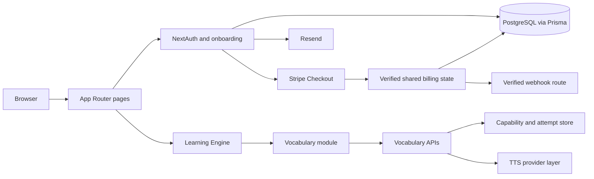

# System Overview

Brain Genius is a Next.js App Router application with a public marketing site, account and onboarding flows, a small application area, a reusable browser-side Learning Engine, and Vocabulary as the first complete learning module.

## Runtime and framework

The installed versions in `package.json` and `.nvmrc` are authoritative:

| Area | Current version or contract |
| --- | --- |
| Node.js | `24.14.1` (`>=24.14.1 <25`) |
| Next.js | `16.2.9`, App Router |
| React / React DOM | `19.2.4` |
| TypeScript | `^5`, strict, no emit |
| Tailwind CSS | v4 CSS configuration in `src/app/globals.css` |
| Prisma | `7.8.0`, PostgreSQL through `@prisma/adapter-pg` |
| Authentication | NextAuth v4.24.14 with JWT sessions and Prisma adapter |
| Validation | Zod v4.4.3 plus strict custom parsers at learning security boundaries |

The root layout loads Plus Jakarta Sans and Baloo 2, imports the one global stylesheet, and wraps the application in `SessionProvider`.

## Product surfaces

- `src/app/(website)/` owns the public home and blog pages and composes the marketing header and blocks.
- `src/app/(auth)/` owns sign-in, credentials/Google sign-up, email verification, password reset, and authenticated onboarding.
- `src/app/(app)/dashboard/` is currently a placeholder.
- `src/app/(app)/(learning)/learning/[...learning]/` hosts a client-side learning session.
- `src/app/playground/` and `src/app/le-playground/` expose development/demo surfaces; they are not production access controls.
- `src/app/api/` exposes NextAuth, account recovery, Vocabulary content/grading/speech, generic TTS, and Stripe webhook HTTP boundaries.

## Subsystems and data flow

The host application owns authentication, accounts, onboarding, subscriptions, database infrastructure, and email. The Learning Engine is subject-neutral: it loads a module, routes generic actions, applies module `ScreenRequest` objects, resolves registered windows, and coordinates speech. Vocabulary owns subject content, attempts, progression, mastery, review scheduling, and completion.

## Current limitations

- Learning progress and Vocabulary capability state are process-local and are not persisted to PostgreSQL. The capability store is unsuitable as a multi-instance guarantee.
- The Vocabulary route ID is a real `ModVocabList.id` owned by the signed-in user, loaded through `src/learning-modules/vocabulary/server/vocabularyListStore.ts`; there is still no dashboard list selector or launcher.
- The proxy matcher covers `/dashboard` and `/getting-started`, not `/learning/**`. It also lets requests without a token continue, so the dashboard is not proven protected by the current proxy/page source; both paid TTS routes independently authenticate and check entitlement at their own server boundary rather than relying on the proxy.
- `/api/tts` and `/api/learning/vocabulary/speech` require an authenticated, currently entitled (direct or child-inherited) caller and share one server-owned paid-usage policy (`src/lib/learning-engine/speech/ttsUsageService.ts`) with durable PostgreSQL accounting, five-hour warning / ten-hour daily cutoff enforcement, burst/concurrency leases, and manual suspension. Long public teaching passages are chunked client-side to the 5,000-byte provider boundary via `chunkSpeechText.ts`.
- Billing has no durable webhook event ledger or full stale/out-of-order reconciliation architecture; audit #27 remains deferred.
- The dashboard and blog pages are placeholders, and the learning header and Vocabulary's status panel show static presentation data.

See [Application and Route Map](application-and-route-map.md), [Learning Engine and Module Boundaries](learning-engine-and-module-boundaries.md), and [Security and Server Boundaries](security-and-server-boundaries.md).
